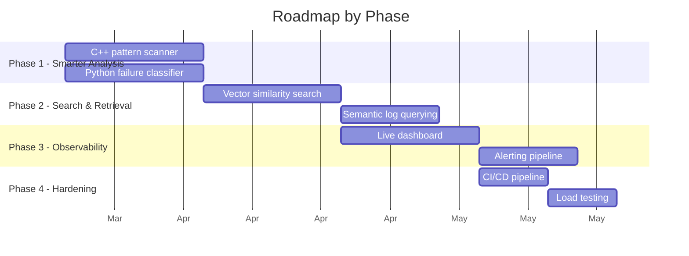
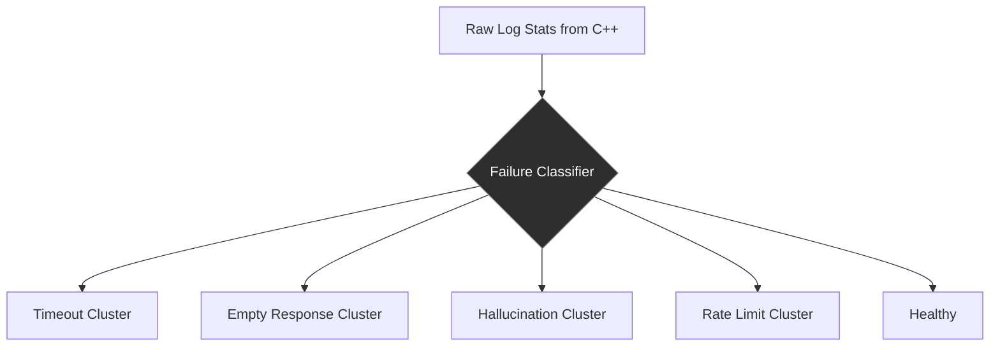
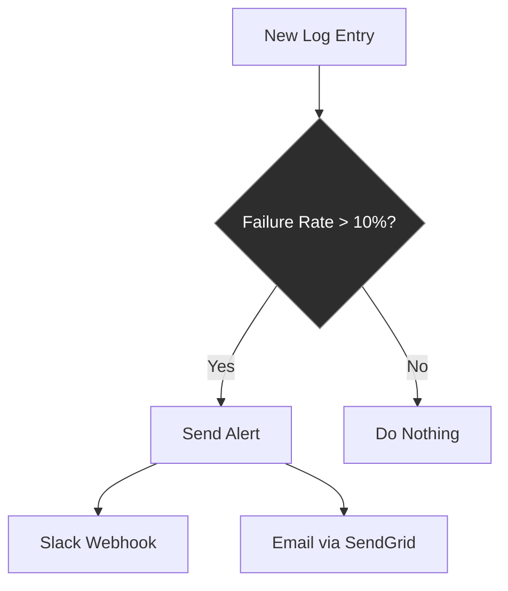
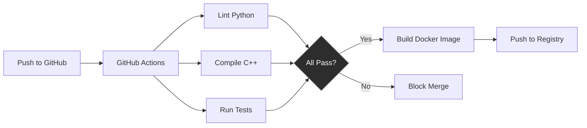

# Next Steps — Architecture & Design Roadmap

This document outlines where the LLM Failure Toolkit should go next,
what to build in C++ vs Python, and why.

---

## Where You Are Now


You have a working pipeline: prompts go in, structured logs come out,
and a cached API serves stats. The foundation is solid. The question
now is **what to layer on top**.

---

## The Two Tracks: C++ vs Python

Not everything should be C++. Not everything should be Python.
Here is how to think about it:

```
┌──────────────────────────────────────────────────────────┐
│                   DECISION FRAMEWORK                      │
├──────────────────────────┬───────────────────────────────┤
│        USE C++           │         USE PYTHON            │
├──────────────────────────┼───────────────────────────────┤
│ Hot path (runs on every  │ Orchestration, glue code      │
│ request or every line)   │                               │
│                          │ LLM API calls (I/O bound,     │
│ CPU-bound parsing,       │ language doesn't matter)      │
│ counting, scanning       │                               │
│                          │ Validators and business logic  │
│ Memory-mapped file I/O   │ (readability > raw speed)     │
│                          │                               │
│ Anything that processes  │ Dashboards, reporting,        │
│ >100K lines per call     │ visualization                 │
└──────────────────────────┴───────────────────────────────┘
```

**Rule of thumb:** If the bottleneck is **CPU or memory**, write it in C++.
If the bottleneck is **network or developer time**, write it in Python.

---

## Proposed Next Phases



---

## Phase 1: Smarter Log Analysis

Right now the C++ binary counts total lines and error lines.
That is useful but shallow. The next step is **pattern detection**.

### 1a. C++ Pattern Scanner (build this in C++)

The idea: scan the JSONL logs and extract structured failure patterns,
not just "has the word error".

```
┌─────────────────────────────────────────────────────┐
│              C++ Pattern Scanner                     │
│                                                     │
│  Input:  data/runs.jsonl                            │
│                                                     │
│  Output (JSON to stdout):                           │
│  {                                                  │
│    "total_lines": 847,                              │
│    "error_lines": 23,                               │
│    "validation_failures": 12,                       │
│    "timeout_count": 3,                              │
│    "empty_response_count": 5,                       │
│    "avg_latency_ms": 2340.5,                        │
│    "p95_latency_ms": 8100.0,                        │
│    "errors_by_agent": {                             │
│      "gemini": 8,                                   │
│      "openai": 15                                   │
│    },                                               │
│    "failure_rate_by_hour": { ... }                  │
│  }                                                  │
└─────────────────────────────────────────────────────┘
```

**Why C++:** You are parsing every single JSON line. For a 100K-line
log file, Python would take 2-3 seconds. C++ with threads does it
in under 100ms. The gap matters when this runs on every API request.

**What to learn here:**
- JSON parsing in C++ (look at `nlohmann/json` or `simdjson`)
- `simdjson` is especially interesting — it parses JSON at GB/s speeds
  using SIMD CPU instructions. Great resume line.
- Structured output: make the binary output valid JSON so Python
  can `json.loads()` the stdout directly.

### 1b. Python Failure Classifier (build this in Python)

Take the raw stats from 1a and classify failures into categories:



**Why Python:** Classification logic changes often. You will iterate
on thresholds, add new categories, maybe plug in an LLM to help
classify. Python is the right tool for fast iteration.

**New validators to consider:**
- `HallucinationValidator` — check if the response contradicts the prompt
- `RelevanceValidator` — does the answer actually address the question
- `ConsistencyValidator` — run the same prompt twice, compare outputs

---

## Phase 2: Vector Search & Semantic Querying

You mentioned you already have vector embeddings. This is where
they become useful.

### 2a. Similarity Search Endpoint


```
GET /search?q=timeout+errors+on+gemini&top_k=5

Response:
{
  "results": [
    {
      "run_id": "bench-2026-03-...",
      "prompt": "Explain quantum computing",
      "agent": "gemini",
      "similarity": 0.94,
      "error_meta": { "ok": false, "error_type": "TimeoutError" }
    },
    ...
  ]
}
```

**Technology choices:**
- For <100K vectors: `numpy` cosine similarity is fine (you already have numpy)
- For 100K-1M vectors: `FAISS` (Facebook's library, C++ under the hood, Python bindings)
- For >1M vectors or production: dedicated vector DB (Qdrant, Weaviate, or pgvector)

**Start with numpy. Migrate when it gets slow.** Premature optimization
on the storage layer is a common trap.

### 2b. Semantic Log Querying

Natural language queries over your logs, powered by the LLM agents
you already have:

```
"Show me all failures from last week where gemini timed out
 and the prompt was about code generation"
```

The flow:
1. Embed the query
2. Vector search for relevant logs
3. Pass the top-K results as context to an LLM
4. LLM returns a structured answer

This is a **RAG (Retrieval-Augmented Generation) pipeline** —
a high-value pattern to have in your toolkit.

---

## Phase 3: Observability Dashboard

### 3a. Live Dashboard

```
┌─────────────────────────────────────────────────────────┐
│  LLM Failure Toolkit — Dashboard                        │
├─────────────┬─────────────┬─────────────┬──────────────┤
│ Total Runs  │ Failure %   │ Avg Latency │ Cache Hit %  │
│   1,247     │   4.2%      │   2.3s      │   78%        │
├─────────────┴─────────────┴─────────────┴──────────────┤
│                                                         │
│  Failures by Agent (last 24h)                          │
│  ┌─────────────────────────────────────────┐           │
│  │ gemini  ████████░░░░░░  12              │           │
│  │ openai  ███░░░░░░░░░░░   4              │           │
│  │ stub    ░░░░░░░░░░░░░░   0              │           │
│  └─────────────────────────────────────────┘           │
│                                                         │
│  Latency Trend (p50 / p95)                             │
│  ┌─────────────────────────────────────────┐           │
│  │     p95                                  │           │
│  │  ╱╲    ╱╲                               │           │
│  │ ╱  ╲  ╱  ╲     p50                     │           │
│  │╱    ╲╱    ╲───────────                  │           │
│  └─────────────────────────────────────────┘           │
│                                                         │
│  Recent Failures                                        │
│  ┌─────────────────────────────────────────┐           │
│  │ 14:23  gemini  TimeoutError  "Explain.."│           │
│  │ 14:21  openai  EmptyOutput   "What is.."│           │
│  │ 13:58  gemini  TimeoutError  "Generate."│           │
│  └─────────────────────────────────────────┘           │
└─────────────────────────────────────────────────────────┘
```

**Technology options:**
- **Lightweight (recommended to start):** Add a `GET /stats` endpoint
  that returns aggregated metrics. Build a simple frontend with
  plain HTML + Chart.js. No React needed for this.
- **Production-grade:** Expose Prometheus metrics from FastAPI
  (`prometheus-fastapi-instrumentator`), visualize in Grafana.
  This is what real observability teams use.

### 3b. Alerting



Don't over-engineer this. A background task that checks failure rates
every N minutes and sends a webhook is enough to start.

---

## Phase 4: Production Hardening

### 4a. CI/CD Pipeline



**Minimum viable CI:**
- `ruff` for Python linting (fast, modern, replaces flake8+isort+black)
- `g++ -Wall -Werror` to catch C++ warnings as errors
- `pytest` for Python tests
- Docker build to verify the image builds cleanly

### 4b. Load Testing

You have a multithreaded C++ binary and a cached API. How fast is it
actually? Find out.

- `wrk` or `hey` to hit `/process-logs` with concurrent requests
- Measure: requests/sec, p99 latency, cache hit ratio under load
- Find the bottleneck: Is it the C++ binary? Redis? Python GIL?

---

## What to Build Next in C++ (specifically)

Here are C++ projects that make sense for this toolkit and
will grow your systems programming skills:

```
┌────────────────────────────────────────────────────────────┐
│  C++ PROJECT IDEAS (ordered by difficulty)                  │
├────────────────────────────────────────────────────────────┤
│                                                            │
│  1. JSON-aware log scanner (use simdjson)                  │
│     Parse JSONL, extract fields, compute per-agent stats   │
│     Difficulty: ██░░░                                      │
│                                                            │
│  2. Memory-mapped file reader                              │
│     Use mmap() instead of ifstream for large files         │
│     Benchmarks show 3-5x speedup on files >10MB           │
│     Difficulty: ███░░                                      │
│                                                            │
│  3. Ring buffer for streaming logs                         │
│     Fixed-size circular buffer that holds the last N logs  │
│     Useful for real-time monitoring without growing memory │
│     Difficulty: ███░░                                      │
│                                                            │
│  4. Lock-free concurrent queue                             │
│     Replace the mutex with atomic operations               │
│     Learn compare-and-swap, memory ordering                │
│     Difficulty: ████░                                      │
│                                                            │
│  5. Custom allocator for JSON parsing                      │
│     Arena/pool allocator to reduce malloc overhead         │
│     when parsing thousands of JSON objects                 │
│     Difficulty: █████                                      │
│                                                            │
└────────────────────────────────────────────────────────────┘
```

---

## What to Build Next in Python (specifically)

```
┌────────────────────────────────────────────────────────────┐
│  PYTHON PROJECT IDEAS (ordered by impact)                  │
├────────────────────────────────────────────────────────────┤
│                                                            │
│  1. More validators (hallucination, relevance, cost)       │
│     Plug into the existing validator framework             │
│     Impact: █████                                          │
│                                                            │
│  2. RAG pipeline over logs                                 │
│     "Why did gemini fail on Tuesday?" answered by an LLM   │
│     with your actual log data as context                   │
│     Impact: █████                                          │
│                                                            │
│  3. A/B testing framework                                  │
│     Run the same prompts on two model versions,            │
│     statistically compare failure rates                    │
│     Impact: ████░                                          │
│                                                            │
│  4. Cost tracker                                           │
│     Track token usage per agent per run                    │
│     "Gemini costs $0.03/query, OpenAI costs $0.01/query"  │
│     Impact: ████░                                          │
│                                                            │
│  5. Pytest suite                                           │
│     Unit tests for validators, integration tests for API   │
│     Makes everything else safer to build                   │
│     Impact: ████░                                          │
│                                                            │
└────────────────────────────────────────────────────────────┘
```

---

## Suggested Order of Execution

```
  NOW          NEXT 2 WEEKS       NEXT MONTH         LATER
   │                │                  │                │
   ▼                ▼                  ▼                ▼

 Push Docker    C++ JSON scanner    Vector search    Dashboard
 changes to     with simdjson       endpoint         + Grafana
 main           (Phase 1a)          (Phase 2a)       (Phase 3)

                More validators     RAG pipeline     CI/CD
                (Phase 1b)          (Phase 2b)       (Phase 4)

                Pytest suite        A/B framework
```

Start with **Phase 1a** (C++ JSON scanner with `simdjson`). It builds
directly on what you already have, teaches you a powerful library,
and gives the API much richer data to serve.

---

## One Piece of Honest Feedback

The toolkit already has more breadth than most portfolio projects.
The risk now is spreading too thin. Pick **one phase**, finish it
end-to-end (C++ binary + Python integration + API endpoint + tests),
and commit it before moving to the next. A finished vertical slice
is worth more than three half-built features.
